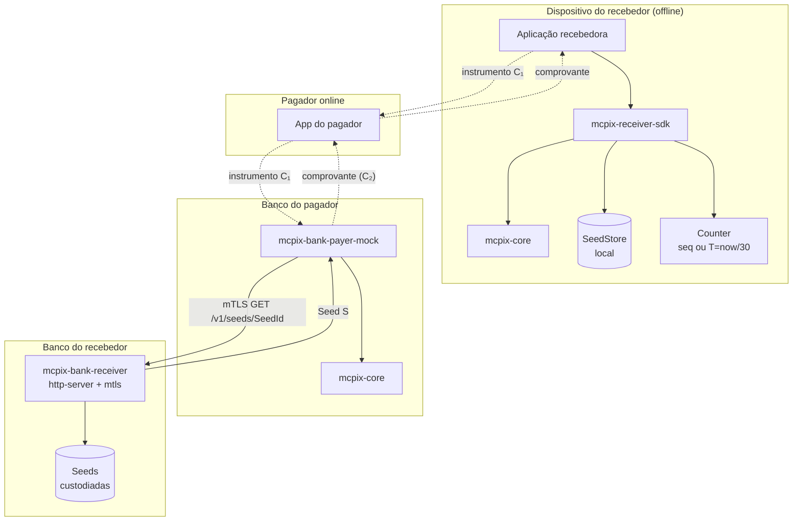

# Arquitetura do mcpix-sdk

## 1. Visão geral

O SDK implementa um protocolo de **validação local de transações de
pagamento** entre três atores assimétricos:

- **Recebedor** — opera *offline* (sem garantia de conectividade no
  momento da cobrança). Gera um par criptográfico atômico `(C₁, C₂)`,
  publica `C₁` no instrumento de cobrança e retém `C₂` localmente até
  receber o comprovante.
- **Pagador** — opera online, intermedia entre o recebedor e o sistema
  bancário. Transmite o instrumento de cobrança ao próprio banco e
  devolve um comprovante ao recebedor por canal de transporte
  arbitrário (OCR, digitação, NFC).
- **Banco do pagador** — recompõe `C₂` a partir de `C₁` e da semente
  do recebedor consultada institucionalmente. Devolve o comprovante
  estruturado contendo `C₂` no campo identificador.

A propriedade técnica central é a **substituição institucional**:
o banco do pagador, sem qualquer canal direto com o recebedor, é
capaz de reproduzir o `C₂` esperado pelo recebedor. Detalhes em
[PROTOCOL.md](./PROTOCOL.md) e [CRYPTO.md](./CRYPTO.md).

## 2. Decomposição em crates

```
mcpix-sdk-internal/
├── crates/
│   ├── mcpix-core              # núcleo cripto + protocolo (zero I/O)
│   ├── mcpix-receiver-sdk      # fachada Rust do recebedor
│   ├── mcpix-bank-receiver     # backend do banco recebedor
│   ├── mcpix-bank-payer-mock   # simulação do banco do pagador
│   ├── mcpix-ffi               # C-ABI manual (.NET P/Invoke)
│   ├── mcpix-uniffi            # bindings UniFFI (Swift / Kotlin)
│   ├── mcpix-embed             # subset receiver-only no_std
│   └── uniffi-bindgen          # wrapper de versão fixa
├── embedded/                   # binário bare-metal Cortex-M4F
├── examples/                   # demo CLI e2e
├── fuzz/                       # libfuzzer harnesses
├── xtask/                      # automação de build/release
└── docs/                       # este diretório
```

### 2.1 `mcpix-core` — núcleo isolado de I/O

Núcleo Rust puro, zero acesso a rede/disco/hardware. Define:

- **Primitivas criptográficas** (`crypto.rs`): `derive_pair`,
  `derive_c2_from_c1`, `verify_c2` em tempo constante.
- **Tipos opacos** (`types.rs`): `Seed`, `SeedId`, `C1`, `C2`,
  `RetainedReceipt`, `Charge`. Material secreto zeroizado em drop.
- **Codec do campo de transporte** (`transport_field.rs`): encode/parse
  do layout posicional de 35 caracteres alfanuméricos.
- **Lógica de estado** (`state.rs`): funções puras
  `f(estado, comando) → novo_estado`.
- **Traits de I/O** (`traits.rs`): `SeedStore`, `Counter`,
  `SecureRandom`, `Clock`, `HttpTransport`. Plataforma hospedeira
  implementa e injeta.
- **Verificação de integridade** (`integrity.rs`, `signature.rs`):
  SHA-256 + Ed25519 sobre o binário carregado.

Garante a **política de não-pânico** (ver
[adr/0010-no-panic-policy.md](./adr/0010-no-panic-policy.md)): toda
função pública retorna `Result<_, McpixError>`. Pânicos eventuais são
capturados pela camada FFI via `catch_unwind`.

### 2.2 `mcpix-receiver-sdk` — fachada do recebedor

Compõe o núcleo com implementações concretas das traits:

- `InMemorySeedStore` / `SqliteSeedStore` (feature `sqlite`)
- `InMemoryCounter` (sequencial) / `TimestampQuantizedCounter` (T = `now/window`)
- `SystemClock` / `TestClock`
- `OsRandom` (CSPRNG do OS)
- `verify_self` (lê binário + `SHA256SUMS.sig` adjacente)

API pública: `register`, `generate_charge`, `validate_receipt`,
`peek_retained`.

### 2.3 `mcpix-bank-receiver` — backend do banco recebedor

Custódia das sementes dos recebedores cadastrados. Trait `BankReceiver`
com `register_seed`, `lookup_seed`. Implementações:

- `InMemoryBankReceiver` (default, para testes)
- `http_server` (axum) — REST: `POST/GET /v1/seeds/{seed_id}`
- `http_client` (reqwest blocking) — implementa `BankReceiver` contra
  o REST remoto
- `mtls_server` + `mtls_client` — TLS termination com client cert
  verification obrigatória; identidade via SAN URI
  `urn:mcpix:institution:<id>`

### 2.4 `mcpix-bank-payer-mock` — simulação do banco do pagador

`process_payment` recebe o instrumento de cobrança, detecta prefixo do
protocolo (`PIXOFFv1`), faz parse posicional, consulta semente no
banco recebedor e devolve comprovante com `C₂` recomposto.
`process_payment_windowed` faz o mesmo com tolerância de ±N janelas
para o modo timestamp quantizado.

### 2.5 `mcpix-ffi` — C-ABI manual (.NET)

5 funções `extern "C"` (`mcpix_receiver_new`, `register`,
`generate_charge`, `validate`, `free`) + `mcpix_string_free`. Geração
de header C via `cbindgen` (build.rs). Consumido por .NET via
`DllImport`.

### 2.6 `mcpix-uniffi` — bindings Swift / Kotlin

`#[uniffi::export]` proc-macro com `McpixReceiver` como UniFFI Object,
`McpixCharge` como Record, `McpixValidation` como Enum, e
`McpixUniffiError` com variants tipados. Scaffolding gerado por
`uniffi-bindgen` (binário workspace-local para paridade de versão).

### 2.7 `mcpix-embed` — subset no_std

Receiver-only, sem allocator, sem rede. Algoritmo bit-exato com
`mcpix-core` (cross-validated em `tests/cross_validate.rs`). Cabe em
ESP8266 / ESP32 / Cortex-M com QR encoder embarcado opcional
(`qrcodegen-no-heap`).

## 3. Princípios de design

### 3.1 Isolamento de I/O no núcleo

O núcleo nunca instancia clientes HTTP, abre arquivos ou acessa
hardware. Esses efeitos vivem nas fachadas via traits injetadas.
Consequências:

- Núcleo é trivialmente testável (mocks em memória).
- Núcleo porta para `no_std` com mudanças cosméticas (ver
  `mcpix-embed`).
- Política de auditoria: revisor pode ler o núcleo sem precisar
  raciocinar sobre IO concorrente.

Detalhamento em [adr/0004-zero-io-core.md](./adr/0004-zero-io-core.md).

### 3.2 Determinismo da derivação

`(S, T) → (C₁, C₂)` é função pura. Implementações independentes
chegam ao mesmo `C₂`. É o que viabiliza a substituição institucional.
Especificação em [CRYPTO.md](./CRYPTO.md).

### 3.3 Imutabilidade e transição funcional

Tipos do núcleo são `Clone` por construção barata (bytes fixos).
Transições retornam novo estado em vez de mutar. Mutação fica
localizada nos `SeedStore`/`Counter` que vivem fora do núcleo.

### 3.4 Política de não-pânico

Nenhuma função pública do núcleo capota. Toda fronteira FFI é
embrulhada em `std::panic::catch_unwind`. Detalhamento em
[adr/0010-no-panic-policy.md](./adr/0010-no-panic-policy.md).

### 3.5 Defesa em profundidade da integridade

Quatro camadas:

1. **Hash do binário** (S3) — `MCPIX_EXPECTED_SHA256` carimbado em
   build time, `verify_bytes` compara em runtime.
2. **Assinatura do manifesto** (S4) — Ed25519 sobre `SHA256SUMS`, pub
   key embarcada via `include_bytes!`.
3. **Transporte autenticado** (S8) — mTLS bidirecional entre bancos,
   identidade via SAN URI.
4. **Self-check no caller** (FFI/UniFFI) — bindings nativos invocam
   `verify_self()` antes do primeiro `generate_charge`.

Threat model formal em [THREAT_MODEL.md](./THREAT_MODEL.md).

## 4. Diagrama de componentes



## 5. Plataformas alvo

| Plataforma | Crate consumido | Distribuição |
|---|---|---|
| iOS (físico + simulador) | `mcpix-uniffi` | Swift Package + XCFramework |
| Android | `mcpix-uniffi` | `.aar` via Gradle, jniLibs ARM/x86 |
| Backend Java | `mcpix-uniffi` | `.jar` com `.so`/`.dll` no classpath |
| Backend .NET | `mcpix-ffi` | `.nupkg` com `runtimes/<rid>/native/` |
| Linux/Windows servers | Rust nativo | binário cargo |
| ESP32-C3 / Cortex-M | `mcpix-embed` | binário bare-metal cross-compilado |
| ESP8266 (Xtensa) | `mcpix-embed` | requer toolchain fork Espressif |

## 6. Ciclo de release

`xtask` orquestra:

```
build-{linux|windows|android|ios}
  → hash-artifacts (dist/SHA256SUMS)
  → sign-artifacts (dist/SHA256SUMS.sig com Ed25519)
  → package-{aar|xcframework|nuget}
  → GitHub Release com artefatos + assinatura
```

Pipeline detalhado em `.github/workflows/release.yml`.

## 7. Cobertura de testes (sumário)

| Categoria | Quantidade | Local |
|---|---|---|
| Unit tests (mcpix-core) | 22 | inline `#[cfg(test)]` |
| Unit tests (demais crates) | 16 | inline |
| Property-based (proptest) | 14 | `crates/mcpix-core/tests/properties.rs` |
| Integration (FFI, integrity) | 6 | `crates/mcpix-*/tests/` |
| HTTP / mTLS e2e | 7 | `crates/mcpix-bank-receiver/tests/` |
| Cross-validation host ↔ embed | 3 | `crates/mcpix-embed/tests/` |
| Fuzz targets (libfuzzer) | 3 | `fuzz/` |
| Kotlin JVM smoke | 2 | `bindings/kotlin/src/test/` |
| **Total** | **73 testes + 3 fuzzers** | |

Volume de execução do fuzzer em CI semanal: 30 min/target × 3 targets.
