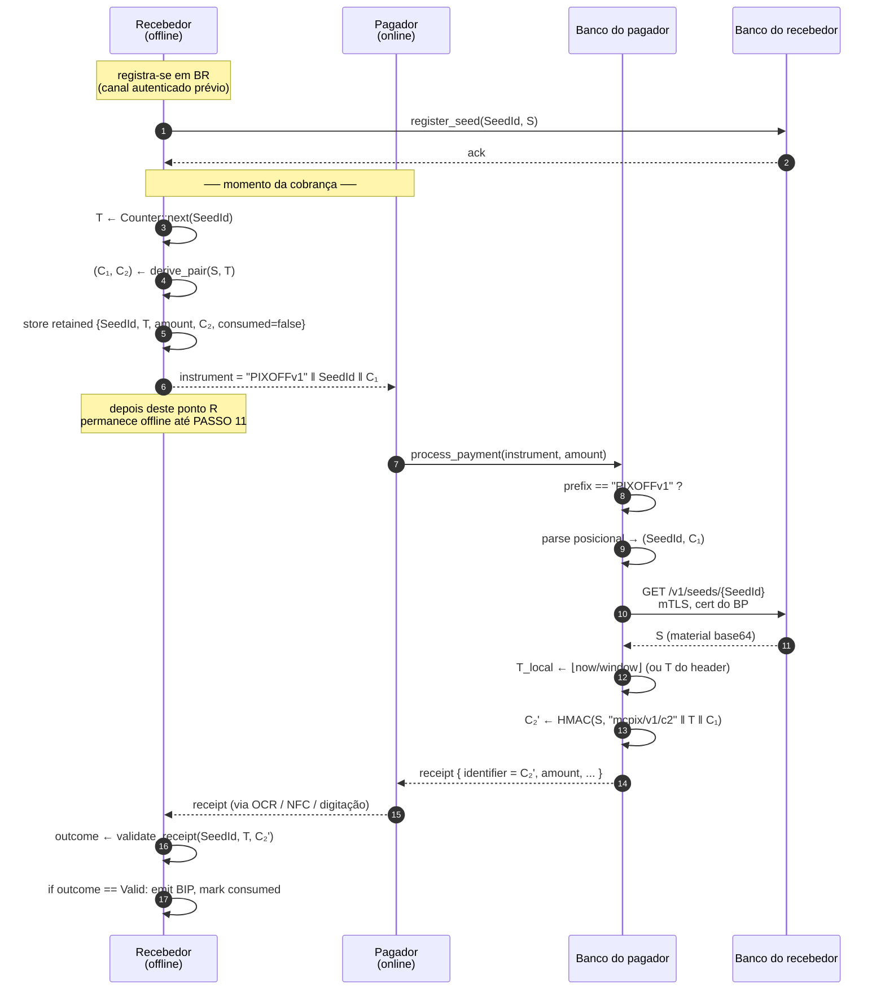
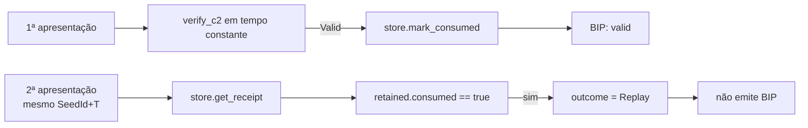

# Protocolo mcpix — especificação

## 1. Atores e papéis

| Papel | Conectividade | Posse de chave | Capacidades |
|---|---|---|---|
| Recebedor | offline | semente `S` local | gera `(C₁, C₂)`; valida C₂ apresentado |
| Pagador | online | nenhuma | transmite instrumento; entrega comprovante |
| Banco do recebedor | online | semente `S` custodiada | atende lookup autenticado |
| Banco do pagador | online | nenhuma persistente | recompõe `C₂` por substituição institucional |

## 2. Estado

### 2.1 Local ao recebedor

- `S` — semente compartilhada, 256 bits gerados por CSPRNG.
- Contador unidirecional `T` por `SeedId` (modo sequencial) **ou**
  `T = ⌊now/window⌋` (modo timestamp quantizado, padrão 30s).
- Para cada cobrança aberta: `RetainedReceipt { seed_id, T, amount, C₂, consumed }`.

### 2.2 Custodiado pelo banco recebedor

- Tabela `(SeedId → S)`, populada via canal autenticado no momento do cadastro.

### 2.3 Público (transitório)

- Campo de transporte: string de 35 chars alfanuméricos contendo
  `PIXOFFv1 ‖ SeedId(16) ‖ C₁(11)`. Detalhes em [CRYPTO.md §4](./CRYPTO.md#4-codificação-do-campo-de-transporte).

## 3. Fluxo principal

### 3.1 Detalhamento dos passos críticos

**Passo 4 (derivação local).** Operação puramente local no dispositivo
do recebedor. Não há rede envolvida. Material `S` não sai do `SeedStore`
do recebedor; apenas `C₁` é exposto. Ver [CRYPTO.md §2](./CRYPTO.md#2-derivação-do-par-atômico).

**Passo 10 (recomposição institucional).** Pedra de toque do protocolo.
O banco do pagador *reconstrói* `C₂` aplicando exatamente a mesma função
de derivação que o recebedor aplicou offline. Como `HMAC-SHA-256` é
determinística e os argumentos `(S, T, C₁)` são conhecidos por ambos os
lados, o `C₂` recomposto é **bit-exato** ao retido pelo recebedor —
sem qualquer canal direto entre eles.

**Passo 11 (entrega física).** O canal de transporte do comprovante
é deliberadamente fora do protocolo: OCR de QR code impresso, NFC, ou
digitação manual. O protocolo aceita qualquer canal porque o C₂
apresentado é validado criptograficamente, não autenticado pelo canal.

**Passo 12 (validação local).** Comparação em tempo constante
(`subtle::ConstantTimeEq`) entre `C₂` retido e `C₂` apresentado. Em
caso de `Valid`, marca-se `consumed = true` no `RetainedReceipt`
*antes* do retorno — defesa de replay no nível do store. Ver
[adr/0003-constant-time-comparison.md](./adr/0003-constant-time-comparison.md).

## 4. Substituição institucional

A propriedade técnica que define o protocolo:

> **Definição.** Dado que `(R, BR)` compartilham segredo `S` previamente
> e `BP` consegue obter `S` de `BR` via canal autenticado, então para
> todo `T` e todo `C₁ = HMAC(S, dom_c1 ‖ T)`, vale
> `C₂_{BP} = HMAC(S, dom_c2 ‖ T ‖ C₁) = C₂_{R}`.

**Consequência.** O banco do pagador pode emitir o comprovante
correto sem qualquer comunicação direta com o recebedor. O recebedor,
mesmo persistentemente offline desde o instante da cobrança, valida
o comprovante quando este lhe chega por canal arbitrário.

## 5. Modos de contador

Dois modos suportados, intercambiáveis via injeção da impl `Counter`:

### 5.1 Sequencial (`InMemoryCounter`)

`T_n = T_{n-1} + 1`, inicial 0. Persistido em flash/HSM em produção.
Modo padrão para dispositivos com clock instável ou ausente.

### 5.2 Timestamp quantizado (`TimestampQuantizedCounter`, RFC 6238-style)

`T = ⌊now_unix_secs / window⌋`, default `window = 30s`.

Garantias enforçadas:

- **Monotonia**: nova chamada exige `T > T_anterior`.
- **Anti-colisão**: chamada dentro do mesmo quantum retorna
  `CounterCollision { window_seconds }`.
- **Anti-rollback**: relógio que recua retorna
  `CounterRollback { last, now }`.

Tolerância de drift entre recebedor e banco do pagador: `BP` emite
`2N+1` candidatos `C₂` para `T ∈ [T_now - N, T_now + N]`. Recebedor
testa cada candidato contra o retained — primeiro match vence.

Detalhamento em [adr/0007-dual-counter-mode.md](./adr/0007-dual-counter-mode.md).

## 6. Defesa contra replay

Dois pontos de defesa:

Modo timestamp quantizado adiciona uma terceira defesa: cobranças
adicionais com o mesmo `SeedId` dentro do mesmo quantum são rejeitadas
**antes** de chegar ao store (no `Counter::next`).

## 7. Cadastro inicial

Não detalhado em diagrama porque é fora do escopo crítico do protocolo:
acontece uma vez, em canal autenticado fora-de-banda (visita à
agência, app bancário com OTP, etc.). Resultado: ambos `R` e `BR`
têm cópia de `S` para o mesmo `SeedId`.

Implementação de demo (`receiver_sdk::register` + transferência
explícita no `e2e_demo.rs`) é deliberadamente mock — em produção o
transporte de `S` para `BR` exige `key wrap` sob chave pública do BR
(fora do escopo desta entrega).

## 8. Versionamento

O prefixo `PIXOFFv1` no campo de transporte sinaliza a versão do
esquema. Versões futuras (`PIXOFFv2`, …) podem alterar:

- alfabeto de codificação;
- comprimento dos slots;
- algoritmo de hash (ex. SHA-3, BLAKE3);
- formato do contador.

Sem alterar o prefixo, o banco do pagador faz triagem em O(1) por
comparação de string, e clientes legados continuam operando com
mensagens marcadas com o prefixo que conhecem.
